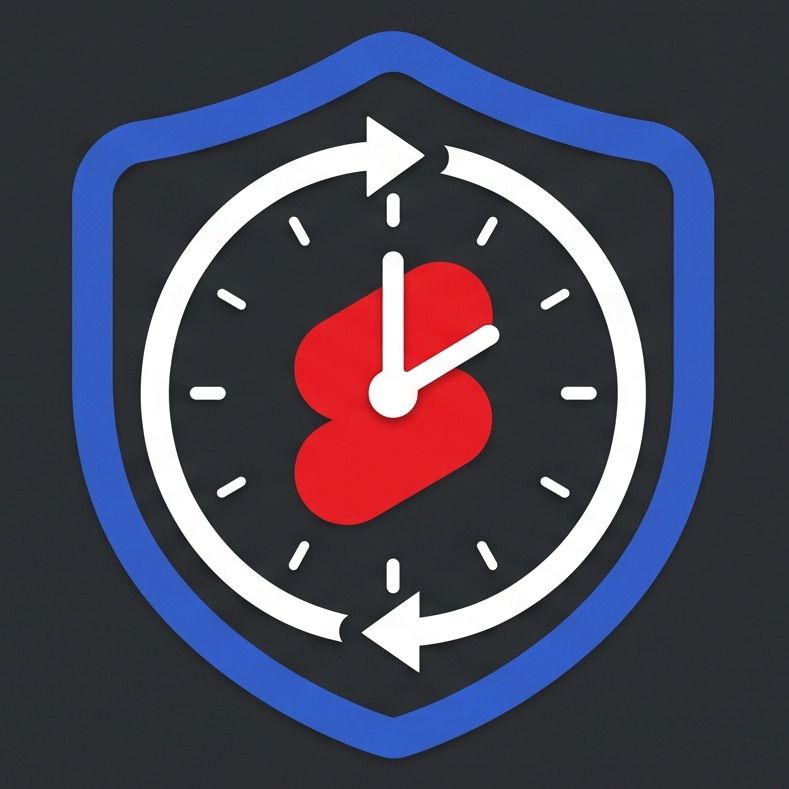
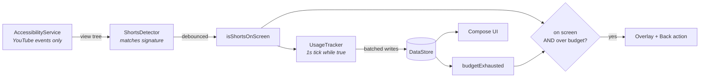

<div align="center">



# YT Shorts Blocker

**A daily time budget for YouTube Shorts — not for YouTube.**

Watch Shorts for the minutes you actually meant to. When the budget is gone, Shorts is blocked
for the rest of the day. Everything else in YouTube keeps working.

<br />


</div>

---

## Why

Blocking YouTube entirely is a blunt instrument — the problem was never the long-form videos you
chose to watch. It is the infinite vertical feed you did not choose.

This app draws the line precisely there. Set a daily budget (15, 30, 60 minutes, or your own
number). Time is counted **only while a Short is actually on screen**. Cross the line and Shorts
gets covered; the home feed, subscriptions, search and normal playback are untouched.

<br />

## Features

| | |
|---|---|
| **Surgical blocking** | Shorts only. Normal YouTube is never interrupted. |
| **Real time accounting** | Counts seconds only while Shorts is genuinely on screen — not while YouTube is merely open. |
| **Automatic daily reset** | Budget refills at midnight, date-stamped so it survives reboots and restarts. |
| **7-day history** | See how much you actually spend, per day, with a live usage ring for today. |
| **Full-screen block** | An overlay drawn over Shorts, plus a Back action to push you out of the feed. |
| **No notification** | The timer rides inside the accessibility service, so there is no permanent notification and no foreground-service permissions. |
| **Fails open** | If detection ever breaks, nothing is blocked. The app can never lock you out of your phone. |

<br />

## How it works

There is no API that reports "the user is watching a Short". The app infers it from the on-screen
view hierarchy, which YouTube exposes through Android's accessibility framework.



**Detection** looks for the Shorts player's own view IDs (`reel_recycler`,
`reel_player_page_container`) and requires them to be *visible to the user* — YouTube keeps
offscreen fragments alive, and the naive check produces false positives. If those IDs ever
disappear, it falls back to matching the Shorts action rail by content description.

**Debouncing is asymmetric** — 500 ms to start, 1500 ms to stop. Swiping between Shorts briefly
tears down the view tree, and a symmetric debounce would read every swipe as "left Shorts" and
reset the timer.

**The tick loop only exists while Shorts is on screen.** It is created when detection turns true
and cancelled when it turns false, so an idle phone does no periodic work at all.

<br />

## Permissions

Two, both of which must be switched on manually in system settings — Android deliberately refuses
to grant either from an in-app dialog.

| Permission | Why | Where |
|---|---|---|
| **Accessibility service** | Read YouTube's view hierarchy to detect Shorts. The only way to do this. | Settings → Accessibility |
| **Display over other apps** | Draw the blocking screen on top of YouTube. | Settings → Apps → Special access |

The app's onboarding deep-links to both and re-checks status every time you return to it.

> The accessibility service is filtered to `com.google.android.youtube` in its manifest config, so
> the system never delivers it events from any other app. It is technically incapable of seeing
> the rest of your device.

<br />

## Build

```bash
git clone git@github.com:Camrado/yt-shorts-blocker.git
cd yt-shorts-blocker
./gradlew assembleDebug
```

Or open in Android Studio and hit **Run**. Then, on the phone:

1. Enable the accessibility service — Settings → Accessibility → **YT Shorts Blocker**
2. Allow display over other apps — the onboarding screen links straight to it
3. Set a daily limit and you are done

> Reinstalling the APK always switches the accessibility service back off. Re-enable it after
> every install — that is Android's behaviour, not a bug.

For day-to-day reliability, also set the app's battery usage to **Unrestricted**, especially on
Samsung / Xiaomi / OnePlus, whose skins kill background apps aggressively.

<br />

## Project layout

```
app/src/main/java/com/example/ytshortsblocker/
├── MainActivity.kt                    # single Activity, hosts the Compose tree
├── data/
│   ├── SettingsRepository.kt          # DataStore: limit, enabled, usage, daily history
│   └── DayUsage.kt
├── service/
│   ├── ShortsAccessibilityService.kt  # events, debouncing, block decision
│   ├── ShortsSignature.kt             # ← the only file YouTube updates can break
│   ├── ShortsDetector.kt              # executes what the signature declares
│   ├── UsageTracker.kt                # the clock and the budget
│   ├── ShortsDetectionState.kt        # StateFlow: is Shorts on screen
│   └── BlockerState.kt                # StateFlow: budget spent, monitoring active
├── overlay/
│   └── BlockOverlayController.kt      # WindowManager overlay lifecycle
├── permissions/                       # checks + deep links + on-resume re-checking
└── ui/                                # Compose screens and theme
```

<br />

## When YouTube breaks it

It will, eventually. Detection depends on YouTube's internal view IDs, and those change without
warning. The symptom is the overlay never appearing — or appearing somewhere it should not.

Everything version-specific lives in **one file**: [`ShortsSignature.kt`](app/src/main/java/com/example/ytshortsblocker/service/ShortsSignature.kt).

1. Set `DEBUG_DUMP_TREE = true` in `ShortsAccessibilityService.kt`
2. Filter Logcat to `tag:ShortsDump`, then capture three trees: **a Short**, **a normal video**,
   and **the home feed**
3. Find a marker present in the first and absent from the other two
4. Update `STRONG_VIEW_IDS` or `ACTION_RAIL_DESCRIPTIONS`, set the flag back to `false`, rebuild

The file also records known **false positives** — `reel_time_bar` appears on every screen
including the home feed, and the content description `"Shorts"` is the bottom navigation tab.
Both look like obvious markers and both are wrong.

<br />

## Stack

Kotlin · Jetpack Compose · Material 3 · Coroutines & Flow · DataStore (Preferences) ·
AccessibilityService · WindowManager overlay

Built for `minSdk 30`. No third-party dependencies beyond AndroidX.

<br />

---

<div align="center">
<sub>A personal project, built to be sideloaded. Not affiliated with YouTube or Google.</sub>
</div>
